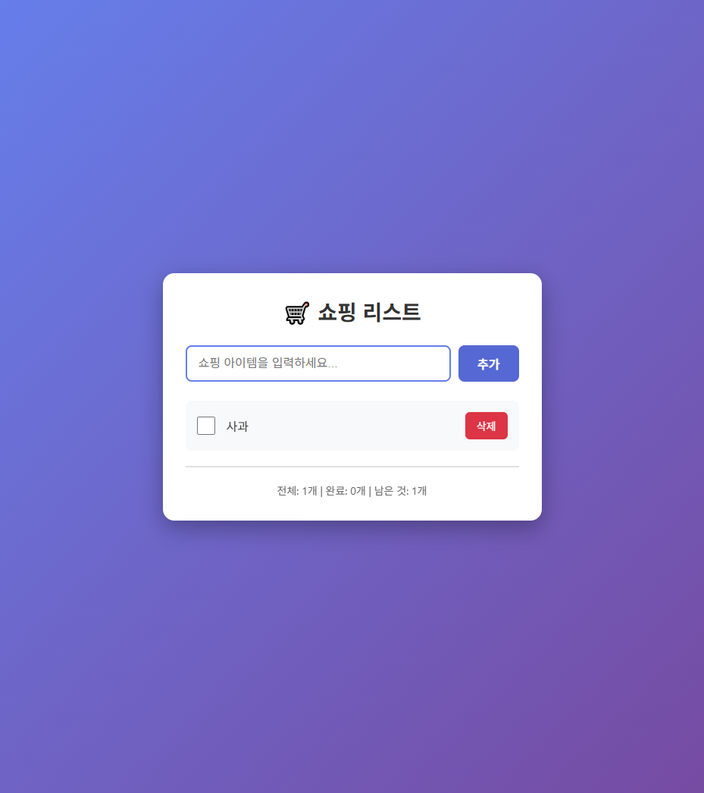

# 🛒 쇼핑 리스트 앱

간단하고 직관적인 쇼핑 리스트 관리 웹 애플리케이션입니다.

## 🌐 데모

**라이브 데모:** https://choiyoungwon1974-pixel.github.io/shopping-list-app/



## ✨ 주요 기능

- ✅ **아이템 추가/삭제**: 쇼핑할 물건을 쉽게 추가하고 삭제할 수 있습니다
- 📝 **체크리스트**: 체크박스로 구매 완료한 아이템을 표시할 수 있습니다
- 💾 **자동 저장**: 로컬스토리지를 사용하여 데이터가 자동으로 저장됩니다
- 📊 **통계 표시**: 전체 아이템, 완료된 아이템, 남은 아이템 수를 실시간으로 확인할 수 있습니다
- 📱 **반응형 디자인**: 모바일, 태블릿, 데스크톱 모든 기기에서 사용 가능합니다
- 🎨 **모던한 UI**: 아름다운 그라디언트 배경과 애니메이션 효과

## 🚀 사용 방법

1. 입력창에 쇼핑할 아이템을 입력합니다
2. "추가" 버튼을 클릭하거나 Enter 키를 누릅니다
3. 구매한 아이템은 체크박스를 클릭하여 완료 표시합니다
4. 필요없는 아이템은 "삭제" 버튼으로 제거합니다

## 🛠️ 기술 스택

- **HTML5**: 시맨틱 마크업
- **CSS3**: 그라디언트, 애니메이션, Flexbox
- **Vanilla JavaScript**: 로컬스토리지 API, DOM 조작
- **GitHub Pages**: 배포 및 호스팅

## 📦 로컬에서 실행하기

```bash
# 저장소 클론
git clone https://github.com/choiyoungwon1974-pixel/shopping-list-app.git

# 디렉토리 이동
cd shopping-list-app

# 브라우저로 index.html 파일 열기
```

## 🔒 보안

- XSS 공격 방지를 위한 HTML 이스케이프 처리
- 안전한 로컬스토리지 데이터 저장

## 📄 라이선스

MIT License

## 👤 만든 사람

**choiyoungwon1974-pixel**
- GitHub: [@choiyoungwon1974-pixel](https://github.com/choiyoungwon1974-pixel)

---

⭐ 이 프로젝트가 도움이 되었다면 Star를 눌러주세요!
